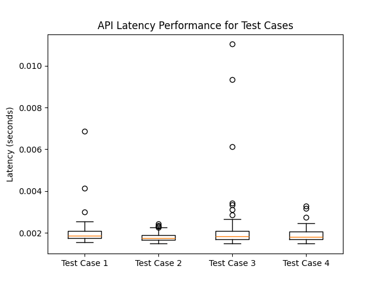

### Activity 6_2 Performance Box Plot: 

### Activity 6 AWS Deployment with Unit & performance: 

My AWS Link:
http://serve3-env.eba-pnvmffii.ca-central-1.elasticbeanstalk.com/

To run it on aws:
Terminal 1:
(env) tasfiaislam@Tasfias-MBP ~/Desktop/ECE444/Labs/Lab5/Lab5vscode/lab5 % gunicorn -w 4 -b 0.0.0.0:8000 application:application

In another terminal:
download flask, scikit then
pip install gunicorn

(env) tasfiaislam@Tasfias-MBP ~/Desktop/ECE444/Labs/Lab5/Lab5vscode/lab5 % python -m pytest

(env) tasfiaislam@Tasfias-MBP ~/Desktop/ECE444/Labs/Lab5/Lab5vscode/lab5 % python -m unittest tests.Unit_test

(env) tasfiaislam@Tasfias-MBP ~/Desktop/ECE444/Labs/Lab5/Lab5vscode/lab5 % python Latency_test.py   
